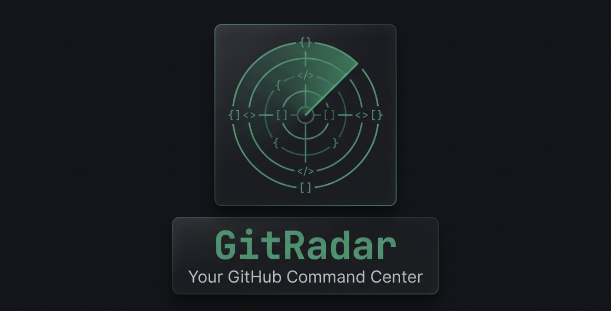

<div align="center">

# GitRadar



**A GitHub monitoring platform for unified tracking of pull requests, issues, and repository activity**

[](https://flutter.dev)
[](https://dart.dev)
[](https://serverpod.dev)
[](https://www.postgresql.org)
[](LICENSE)
[]()

[Live Demo](https://gitradar.api.serverpod.space/) | [Documentation](docs/) | [Getting Started](docs/GETTING_STARTED.md)

</div>

---

## Overview

GitRadar provides developers with a clean, distraction-free command center for GitHub activity. Monitor multiple repositories, receive smart notifications, and stay on top of what matters without the noise.

### Key Features

| Feature | Description |
|---------|-------------|
| **Multi-Repository Monitoring** | Track up to 10 repositories in a single unified dashboard |
| **Unified Activity Feed** | View all PRs and issues across repositories with advanced filtering |
| **Granular Notifications** | Configure in-app and push notifications per repository |
| **Background Sync** | Automatic synchronization every 5 minutes via Serverpod scheduler |
| **Manual Refresh** | Force sync data from GitHub on demand |
| **Theme Support** | Full light, dark, and system theme modes |
| **Anonymous Mode** | Browse public repositories without authentication (60 req/hr limit) |

---

## Quick Start

### Prerequisites

- [Flutter SDK](https://docs.flutter.dev/get-started/install) 3.x or higher
- [Docker Desktop](https://www.docker.com/products/docker-desktop/)
- [Serverpod CLI](https://docs.serverpod.dev/)

```bash
dart pub global activate serverpod_cli
```

### Installation

```bash
# Clone the repository
git clone https://github.com/anthropics/gitradar.git
cd gitradar

# Run setup script
./scripts/setup.sh

# Start PostgreSQL database
./scripts/db-start.sh

# Start Serverpod server (terminal 1)
./scripts/server-start.sh

# Start Flutter app (terminal 2)
cd app && flutter run -d chrome --web-port=3000
```

### Development URLs

| Service | URL |
|---------|-----|
| Server | `http://localhost:8080` |
| App | `http://localhost:3000` |
| Production API | `https://gitradar.api.serverpod.space/` |

---

## Architecture

```
gitradar/
├── server/                  # Serverpod backend
│   ├── lib/src/
│   │   ├── endpoints/       # RPC endpoints (not REST)
│   │   ├── models/          # Database models (.spy.yaml)
│   │   ├── services/        # Business logic layer
│   │   └── futures/         # Scheduled background jobs
│   └── migrations/          # Database migrations
├── app/                     # Flutter application
│   └── lib/src/
│       ├── features/        # Feature-based modules
│       ├── core/            # Theme, client, constants
│       ├── providers/       # Global Riverpod providers
│       └── routing/         # GoRouter configuration
├── gitradar_client/         # Auto-generated Serverpod client
├── scripts/                 # Development helper scripts
└── docs/                    # Project documentation
```

---

## Tech Stack

| Layer | Technologies |
|-------|--------------|
| **Frontend** | Flutter 3, Riverpod, GoRouter, Material 3 |
| **Backend** | Serverpod 3, Dart |
| **Database** | PostgreSQL 16 |
| **Push Notifications** | OneSignal |
| **Deployment** | Serverpod Cloud |

---

## Documentation

| Document | Description |
|----------|-------------|
| [ARCHITECTURE.md](docs/ARCHITECTURE.md) | System architecture and technical diagrams |
| [DATABASE.md](docs/DATABASE.md) | Database schema and DBML definitions |
| [GETTING_STARTED.md](docs/GETTING_STARTED.md) | Detailed development setup guide |
| [PRD.md](docs/PRD.md) | Product requirements and roadmap |
| [CLAUDE.md](CLAUDE.md) | AI assistant development instructions |

---

## Scripts Reference

| Script | Description |
|--------|-------------|
| `./scripts/setup.sh` | First-time setup (install dependencies, generate code) |
| `./scripts/db-start.sh` | Start PostgreSQL via Docker |
| `./scripts/db-stop.sh` | Stop PostgreSQL container |
| `./scripts/db-reset.sh` | Reset database (destructive) |
| `./scripts/server-start.sh` | Start Serverpod server |
| `./scripts/generate.sh` | Regenerate code after model changes |

---

## Contributing

1. Fork the repository
2. Create a feature branch
   ```bash
   git checkout -b feature/your-feature-name
   ```
3. Commit your changes
   ```bash
   git commit -m "Add: description of your feature"
   ```
4. Push to the branch
   ```bash
   git push origin feature/your-feature-name
   ```
5. Open a Pull Request

For detailed development setup, see [GETTING_STARTED.md](docs/GETTING_STARTED.md).

---

## License

This project is licensed under the MIT License. See [LICENSE](LICENSE) for details.

---

## Acknowledgments

- Built for the [Serverpod 3 Global Hackathon](https://serverpod.dev)
- [GitHub REST API](https://docs.github.com/en/rest) for repository data

---

<div align="center">

**Built by [@adityawaslost](https://x.com/adityawaslost)**

</div>
